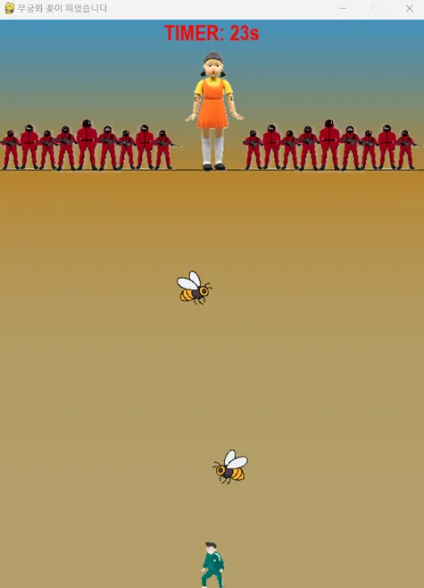

# 🦑 오징어게임: 무궁화 꽃이 피었습니다

파이썬의 `pygame`을 활용하여 만든 미니게임입니다.  
유명 드라마 *오징어게임*의 "무궁화 꽃이 피었습니다" 게임을 구현하였습니다.  
플레이어가 제한 시간 내 결승선에 도달하고, 영희가 돌아볼 때는 멈추지 않으면 탈락하게 됩니다.

---

## 🎮 프로젝트 개요

- **개발 기간:** 2025.01.10 ~ 2025.01.13  
- **개발 환경:** Python 3.9, pygame  
- **목적:** Python 학습 후 첫 개인 미니 프로젝트

---

## 🧩 주요 기능

- `pygame` 기반 2D 게임 인터페이스
- 배경음악 재생 및 멈춤 감지
- 플레이어 키보드 이동 및 자동 탈락 판정
- 캐릭터 애니메이션 및 효과음 출력
- 타이머 + 벌 장애물 등장으로 난이도 추가

---

## 🗂 폴더 구조
squid_game_project/
│
├── Squid_Game.py             # 메인 실행 파일
├── README.md                 # 프로젝트 설명 파일
│
└── assets/                   # 리소스 폴더
    ├── images/               # 캐릭터 및 배경 이미지
    │   ├── bee1.png
    │   ├── player.png
    │   └── ...
    │
    └── sounds/               # 효과음 및 배경음악
        ├── 무궁화.mp3
        ├── 총소리 효과음.mp3
        └── ...

---

## ▶️ 실행 방법

1. 필수 라이브러리 설치
pip install pygame

2. 게임 실행
python Squid_Game.py

---

## 🧠 제작 동기 & 회고

> **"눈에 보이는 무언가를 만들고 싶다!"**는 생각으로 GUI 기반 게임 개발을 결심했습니다.  
> 강사님의 추천으로 `pygame`이라는 라이브러리를 처음 접하고, 주말 동안 독학해 구현했습니다.

- "무궁화 꽃이 피었습니다"는 단순한 이동 게임일 것 같았지만  
  실제로는 음악 타이밍 제어, 캐릭터 시선 전환, 탈락 판정 등 구현할 요소가 많아 고민이 컸습니다.
- 음악이 동시에 재생되지 않는 문제, 텍스트 줄바꿈 처리 이슈 등 시행착오를 겪으면서  
  `pygame.mixer.Sound()`, `enumerate()` 같은 기능도 함께 학습할 수 있었습니다.
- 장애물인 벌의 이동도 구현했지만, 시간상 두 마리만 반복 이동하게 만들었고  
  향후 AI 패턴이나 난이도 조절 기능도 추가해보고 싶습니다.

> 이 프로젝트는 제 첫 코딩 개인 프로젝트이자,  
> 내가 직접 만든 무언가가 동작하는 것을 눈으로 확인하며 성취감을 느낀 작업이었습니다.

---

## 🎵 리소스 출처

- 캐릭터 이미지: 구글 이미지 검색 활용
- 음원/효과음: 유튜브 음원 라이브러리 참고
- 해당 리소스들은 비상업적 개인 학습용으로만 사용됩니다.

---

## 📌 기타 정보

- **제작자:** Emily  
- **개발환경:** Python 3.9, pygame  
- **향후 개선:** 난이도 조절, 점수 시스템, 벌 AI 개선 등

---

## 🔗 관련 링크

- [프로젝트 상세 노션 정리](https://yeonghyekim.notion.site/179e2859370c80b8bb00d4c336ba5063?pvs=4)

